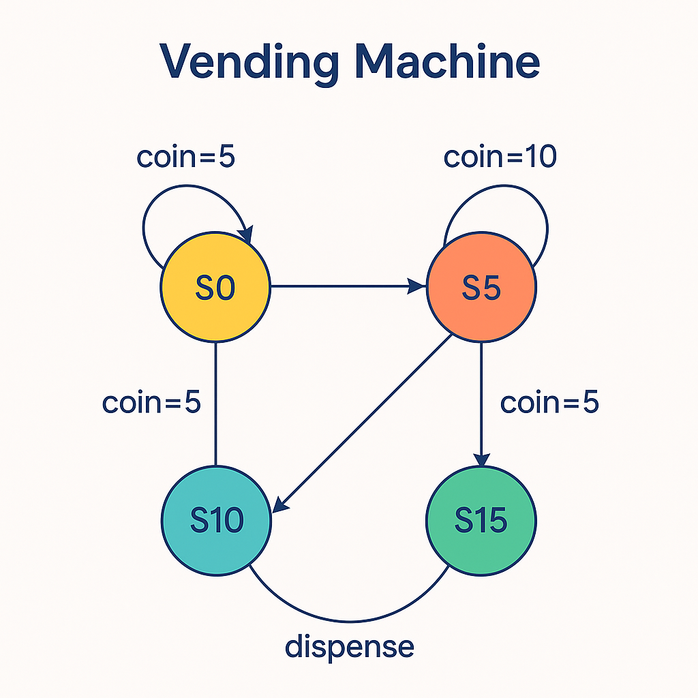
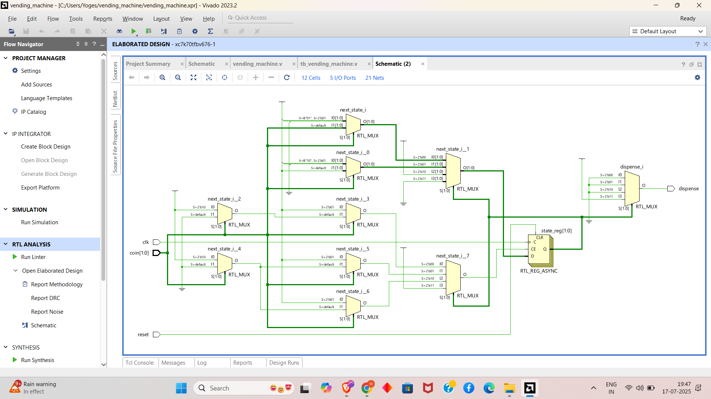
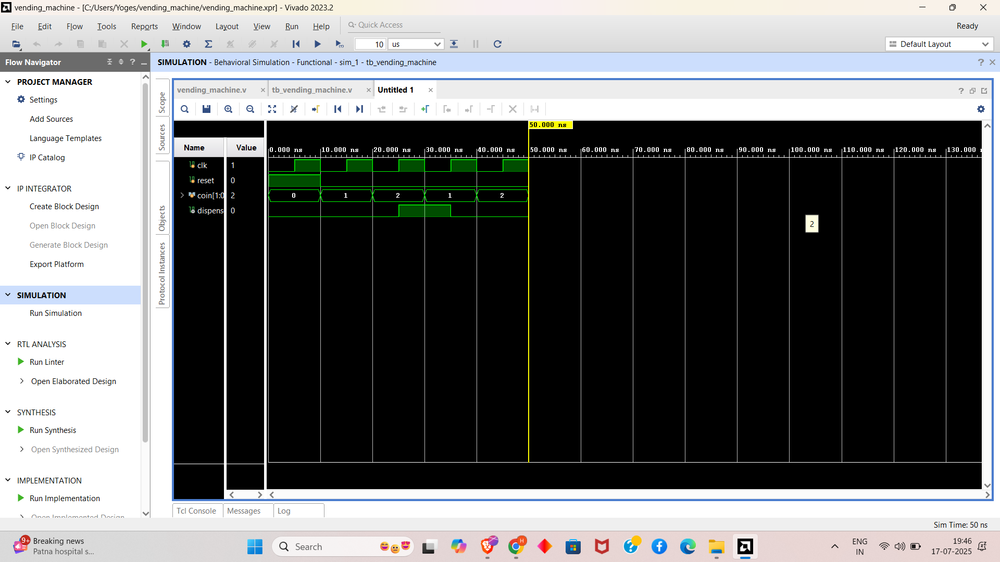

# mealy-moore-fsm_project
This project implements Finite State Machines (FSM) using Verilog, covering both Mealy and Moore models. It includes state diagrams, Verilog code, and testbenches for real-time system control applications, verified through simulation and FPGA synthesis.

# 🔁 Vending Machine FSM Verification

This project is part of the **FPGA Prototyping and Verilog Internship** at Prism Studio, specifically **Task 4: FSM Design - Real-Time System Control**. It focuses on designing and verifying a vending machine module using a Finite State Machine (FSM) implemented in Verilog. The design uses a clock-driven testbench to validate real-time control logic for embedded systems.

It includes:

- ✅ Verilog implementation of a vending machine FSM (Moore or Mealy, as chosen)
- ✅ Testbench to simulate coin insertion and dispensing behavior
- ✅ Verification of state transitions and dispense output
- ✅ Synchronous reset and clock-driven simulation

> Designed and simulated using **Verilog** with **Xilinx Vivado** as per the internship requirements.

---

## 📁 Project Structure

```
├── tb_vending_machine.v       # Testbench module for FSM verification
├── vending_machine.v          # Vending machine FSM module (DUT)
├── vending_machine.xpr        # Vivado project file
├── state_diagram.png          # State transition diagram for the FSM
├── screenshots/               # Folder containing waveform screenshots
│   └── vending_machine_waveform.png
├── README.md                  # Project documentation
```

---

## ✅ Vending Machine FSM Testbench

### 🔍 Description

This project implements a Finite State Machine (FSM) for a vending machine, designed to process coin inputs (e.g., 5 cents, 10 cents) and control the dispensing of an item when sufficient funds are received. The testbench verifies the FSM's state transitions, input processing, and output behavior, ensuring correct operation for real-time control applications. The FSM type (Moore or Mealy) is chosen based on the system requirements, with a focus on clarity and hardware efficiency.

### 🧠 Testbench Stages

| Stage      | Description                  |
|------------|------------------------------|
| GENERATE   | Apply coin inputs and reset  |
| MONITOR    | Observe state transitions and dispense output |


---
---

### 🔁 state transition diagram 


---

## 📡 Signal Description

The following signals are defined in `tb_vending_machine.v`:
- `clk`: Clock signal, toggling every 10 time units (5ns high, 5ns low).
- `reset`: Active-high synchronous reset, held high for 10 time units.
- `coin[1:0]`: 2-bit input for coin types (e.g., `2'b01` = 5 cents, `2'b10` = 10 cents, `2'b00` = no coin).
- `dispense`: Output signal, high when an item is dispensed based on FSM logic.

---

## 🛠️ Components

- **Clock Generator**: Generates a clock with a 10-time-unit period using `forever #5 clk = ~clk`.
- **Stimulus Generator**: Applies a synchronous reset followed by a sequence of coin inputs (`2'b01`, `2'b10`, `2'b01`, `2'b10`) to test FSM state transitions and dispensing behavior.
- **DUT**: The vending machine FSM module (`vending_machine.v`), implementing state-based logic to process coins and control dispensing (assumed to be provided or designed as part of the task).

---

## 🚀 How to Simulate (Xilinx Vivado)

1. Open **Xilinx Vivado** (e.g., Vivado 2023.2 or compatible version).
2. Create a New Project:
   - Select "RTL Project" and enable "Do not specify sources at this time."
3. Add Source Files:
   - Add `tb_vending_machine.v` and `vending_machine.v` to the project.
   - Set `tb_vending_machine` as the top module.
4. Configure Simulation:
   - In the "Simulation" settings, select the Vivado Simulator.
   - Add waveform dumping commands in `tb_vending_machine.v` for debugging:
     ```verilog
     initial begin
         $dumpfile("vending_machine.vcd");
         $dumpvars(0, tb_vending_machine);
     end
     ```
5. Run Simulation:
   - Click "Run Simulation" → "Run Behavioral Simulation."
   - Open the waveform viewer to inspect signals (`clk`, `reset`, `coin`, `dispense`, and FSM states).
6. Analyze Results:
   - Verify the waveform matches the state transition diagram and expected behavior (e.g., dispense on sufficient coin value).
   - Save the waveform as `screenshots/vending_machine_waveform.png`.

---

### 📐 FSM Schematic


---


## 📊 Example Behavior

Assuming the vending machine FSM dispenses when the total coin value reaches 15 cents (based on a Moore or Mealy FSM implementation):

| Time (ns) | reset | coin | dispense | State (Example) |
|-----------|-------|------|----------|-----------------|
| 0         | 1     | 00   | 0        | IDLE            |
| 10        | 0     | 01   | 0        | COIN_5          |
| 20        | 0     | 10   | 1        | DISPENSE        |
| 30        | 0     | 01   | 0        | COIN_5          |
| 40        | 0     | 10   | 1        | DISPENSE        |

> Dispense occurs when the FSM reaches a state corresponding to a total of 15 cents or more (e.g., 5 + 10 = 15 cents).

---

---

## 🖥️ Sample Waveform



---


## 🔧 Tools Used

- **Language:** Verilog
- **Simulator:** Xilinx Vivado Simulator
- **Target Hardware:** FPGA-Compatible RTL (clocked logic)
- **Design Tools:** Vivado for synthesis and simulation, draw.io or similar for state transition diagram

---

## 📌 Features

- Implements an FSM (Moore or Mealy) for vending machine control
- Testbench applies a sequence of coin inputs (5 cents, 10 cents, 5 cents, 10 cents)
- Synchronous reset for consistent FSM initialization
- Clock-driven simulation for edge-triggered state transitions
- Clear state transition diagram for design clarity
- Structured Verilog code for hardware reusability

---

## 🔧 Troubleshooting

- **Compilation Errors**: Ensure both `tb_vending_machine.v` and `vending_machine.v` are added to the Vivado project. Check for syntax errors or undefined modules.
- **Waveform Mismatch**: Verify the coin sequence in `tb_vending_machine.v` aligns with the FSM state transitions in `vending_machine.v`. Ensure the state diagram matches the implemented logic.
- **DUT Issues**: Confirm the vending machine FSM module uses the correct signal names (`clk`, `reset`, `coin`, `dispense`) and implements the intended state transitions.
- **Simulation Stops Early**: Check that the `$stop` statement in the testbench is reached after the desired test sequence. Adjust Vivado simulation time limits if needed.

---

## 🔗 Submission

- [✔️ GitHub Repository](https://github.com/your-username/vending-machine-fsm-verification) *(Update with your repo link)*
- Include the state transition diagram as `state_diagram.png`
- Add waveform screenshot as `screenshots/vending_machine_waveform.png`
- Submit the GitHub repo link via the Prism Studio internship form: [Submit Task](mailto:team@primstudio.co.in)

---

## 🙌 Acknowledgment

This project is an independent effort undertaken as part of the **FPGA Prototyping and Verilog Internship** at Prism Studio to master FSM design and verification. I am grateful for the guidance provided by the Prism Studio team and the availability of Xilinx Vivado, which enabled the simulation and validation of this design. This work reflects my commitment to developing skills in real-time system control and digital design through self-directed learning.

---

## 📧 Contact

For questions, support, or clarifications, contact: [team@primstudio.co.in](mailto:team@primstudio.co.in)